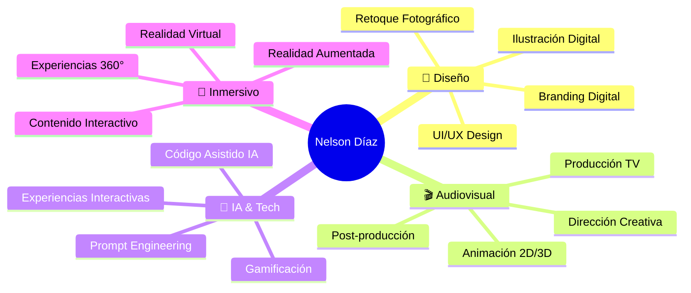

# 🎬 Nelson G. Díaz Pereira
## Diseñador Audiovisual & Especialista en IA

**📍 Lima, Perú** | **📱 +51 987 654 321**

---

## 🚀 Sobre Mí

> **Comunicador audiovisual especializado en IA para producción de contenidos creativos**

Soy un profesional apasionado por la innovación en medios digitales, con expertise en tecnologías emergentes como **AR/VR** e **Inteligencia Artificial**. Como CEO y Co-founder de **HALLEY**, lidero proyectos de marketing digital y eventos, combinando creatividad con tecnología de vanguardia.

### 🎯 Áreas de Especialización
- 🤖 **IA para Contenido Creativo** - Prompt Engineering & Generación de Imágenes
- 🎨 **Diseño Audiovisual** - UX/UI, Animación 2D/3D, Branding
- 🎥 **Producción Televisiva** - Dirección, Post-producción, Documentales
- 🌐 **Experiencias Inmersivas** - AR/VR, Gamificación, Web Interactiva

---

## 💼 Experiencia Profesional

### 🎨 **Director de Creatividad** | *Esedor Agency*
**📅 Oct 2024 - Presente**

🔍 <strong>Ver detalles del rol</strong>

- 🎯 Liderazgo del equipo creativo para campañas de re-branding 2025
- 🚀 Implementación de flujos de trabajo con IA para producción gráfica
- 📊 Desarrollo de keyvisuals y conceptualizaciones para clientes diversos
- 🎬 Creación de productos interactivos y material digital innovador

### 📺 **Asistente de Producción Televisivo** | *IRTP - TV PERÚ*
**📅 Dic 2023 - Oct 2024**

🔍 <strong>Ver detalles del rol</strong>

**Programa:** "Sonidos Del Mundo" - Mabela Martinez
- 🎬 Supervisión de rodajes y scouting de locaciones
- 📚 Investigación documentada y recopilación de archivo
- 📱 Creación de contenido para redes sociales (Reels, Stories)
- 🎞️ Desarrollo de recursos animados para postproducción

### 💻 **Diseñador UI** | *BRIX Agency - México (Remoto)*
**📅 Abr 2022 - Abr 2023**

🔍 <strong>Ver detalles del rol</strong>

- 🌐 Desarrollo de páginas web con estilos gráficos innovadores
- 🎨 Adaptación de sistemas de diseño a tendencias actuales
- 🛍️ Creación de productos web para Webflow Marketplace
- 🎯 Diseño para audiencias amplias y diversas

### 🎬 **Diseñador Audiovisual** | *MarketLogic Perú*
**📅 Dic 2021 - Mar 2022**

🔍 <strong>Ver detalles del rol</strong>

- 🎨 Key Visual Designer para cuentas corporativas
- 🎪 Desarrollo de propuestas estéticas para eventos y conferencias  
- 🥽 Creación de experiencias VR & AR inmersivas
- 📧 Diseño de Dark Posts, Landing Pages y Email Marketing

### 🎯 **UX/UI & Diseñador Audiovisual** | *Esedor Agency*
**📅 Feb 2019 - Oct 2021**

🔍 <strong>Ver detalles del rol</strong>

- 📱 Branding digital y desarrollo de apps web/mobile
- 🎮 Proyectos de gamificación y prototipado
- 🔬 QA testing & user research
- 🎬 Animación 2D/3D & Stop Motion

---

## 🛠️ Stack Tecnológico

### 🎨 **Diseño & UX/UI**

### 🎬 **Audiovisual & 3D**

### 🎵 **Audio**

### 🤖 **IA & Programación**

---

## 🎓 Formación & Certificaciones

### 🏛️ **Educación Principal**
- **🎬 Comunicación Audiovisual en Medios Digitales**  
  *Universidad Privada del Norte* (Mar 2015 - Jun 2022)

### 📜 **Certificaciones**

<!-- Versión GitHub - Slider simulado con tabla -->
<table style="background: #000; border-radius: 15px; padding: 20px;">
<tr>
<td align="center" width="12.5%">

</td>
<td align="center" width="12.5%">

</td>
<td align="center" width="12.5%">

</td>
<td align="center" width="12.5%">

</td>
<td align="center" width="12.5%">

</td>
<td align="center" width="12.5%">

</td>
<td align="center" width="12.5%">

</td>
<td align="center" width="12.5%">

</td>
</tr>
</table>

---

## 🏆 Reconocimientos & Highlights

### 🎤 **Ponencias & Workshops**

#### 🧠 "Presentaciones Inteligentes potenciando tu trabajo con IA"
**📍 Universidad Tecnológica del Perú** | *Agosto 2024*
- 🤝 Colaboración con David Vargas DaSilva
- 🎯 Taller sobre tecnologías emergentes para presentaciones interactivas

#### ⚡ "The Future of Electricity in Perú 2019 & 2021"
**📍 Cusco, Perú** | *Lead Brand Designer*
- 🎨 Dirección creativa en colaboración con Mijalys Silva
- 🥽 Implementación de experiencias AR & VR
- 🌟 Principal conferencia de desarrollo energético de Sudamérica

### 🎥 **Reconocimientos Técnicos**
- **📹 Chief Cameraman Broadcast Team**  
  *Universidad Privada del Norte* (2018)  
  *Certificación honorífica por desempeño profesional excepcional*

---

## 🌟 Organizaciones & Membresías

### 🤖 **Cámara Peruana de Inteligencia Artificial (CPIA)**
**📅 Desde Junio 2025** | *Área de Comunicaciones - Dirección de Gobierno Digital*

### 🚀 **HALLEY - Eventos y Marketing Digital**
**👑 CEO & Co-Founder**

---

## 📊 GitHub Stats

---

## 🎯 Áreas de Expertise

---

## 🌐 Conecta Conmigo

### 💬 ¿Interesado en colaborar?

**Especializado en proyectos que combinan creatividad, tecnología e innovación**

---

**⭐ Si te gusta mi trabajo, no olvides darle una estrella a este repositorio ⭐**

*Creado con ❤️ por Nelson Díaz | © 2025*

